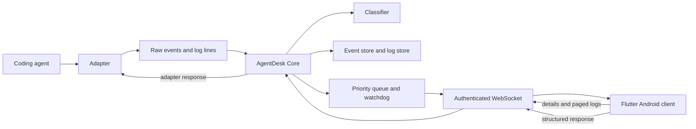
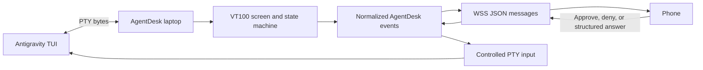

# AgentDesk

AgentDesk is a laptop-side attention and control layer for interactive coding agents, with a Flutter Android client for human supervision.

Coding agents produce substantially more terminal output than a person can continuously monitor. AgentDesk keeps the agent process and detailed logs on the laptop, classifies activity into a small attention model, and sends the phone only the events that are useful for human supervision. The phone can inspect details, page through relevant logs, and return structured decisions without becoming a second terminal.

> **Optimize for human attention, not information volume.**

## Table of Contents

- [Overview](#overview)
- [Core Concept](#core-concept)
- [Key Features](#key-features)
- [Attention Model](#attention-model)
- [Structured Human Interaction](#structured-human-interaction)
- [Antigravity Integration](#antigravity-integration)
- [Architecture](#architecture)
- [Data and Progressive Disclosure](#data-and-progressive-disclosure)
- [Communication Protocol](#communication-protocol)
- [Security](#security)
- [Current Status and Scope](#current-status-and-scope)
- [Repository Layout](#repository-layout)
- [Prerequisites](#prerequisites)
- [Running the Simulator](#running-the-simulator)
- [Running a Real Adapter](#running-a-real-adapter)
- [Building the Android Client](#building-the-android-client)
- [Testing and Validation](#testing-and-validation)
- [Benchmarking](#benchmarking)
- [Limitations and Roadmap](#limitations-and-roadmap)
- [Documentation](#documentation)
- [Contributing](#contributing)
- [License](#license)

## Overview

### What AgentDesk is

AgentDesk is a local-first system for supervising one or more interactive coding-agent sessions while away from the laptop. The laptop runs the adapters, event processor, classifier, queue, log store, watchdog, and WebSocket server. The phone displays a ranked attention queue and provides structured controls for requests that block an agent.

### The problem

Terminal output is optimized for a person sitting at the terminal, not for a person supervising work intermittently. A coding agent may emit thousands of routine lines such as build progress, test output, tool traces, and status updates before producing one approval request or one failure that requires action. Mirroring the terminal to a phone preserves too much noise; suppressing the stream risks missing the important moment.

AgentDesk addresses this by separating:

- **Evidence and log data**: raw terminal or protocol output retained on the laptop.
- **Attention events**: normalized, classified events that may require a human.
- **Control responses**: typed decisions sent back only to the adapter and active task that produced the request.

### Laptop and phone responsibilities

| Responsibility | Laptop | Phone |
|---|---:|---:|
| Run the agent process | ✅ | — |
| Interpret an agent protocol or PTY | ✅ | — |
| Store detailed event data and logs | ✅ | — |
| Classify and rank attention | ✅ | — |
| Push concise event summaries | ✅ | ✅ |
| View event details | Serves | Displays |
| View raw logs | Pages and bounds | Requests and displays |
| Approve, deny, or answer a request | Validates and dispatches | Collects structured input |

The Flutter client is intentionally an attention and control interface. It is not a remote terminal and does not receive the raw PTY stream.

### Attention filtering and progressive disclosure

AgentDesk uses three levels of information:

| Level | Content | Delivery |
|---|---|---|
| Level 1 | Category, agent, project, summary, and one-line message | Pushed as an event |
| Level 2 | Task, operation, file, line, error details, and request schema | Available with the event or on detail fetch |
| Level 3 | Raw agent logs around the event | Paged from the laptop on demand |

This lets a user decide whether to act without opening a full log, then progressively inspect more evidence only when needed.

### Architecture at a glance



## Core Concept

The normal forward path is:

```text
Coding Agent
    → Adapter
    → AgentDesk Core
    → Attention / Event Classification
    → Priority Queue and Scoring
    → WebSocket Transport
    → Phone
```

The reverse control path is:

```text
Phone
    → Structured Response
    → AgentDesk Server and Core
    → Adapter
    → Coding Agent
```

Adapters normalize agent-specific activity into `RawAgentEvent` values. The processor assigns daemon-local identity and ordering, stores an immutable `Event`, classifies it into one of four categories, and creates queue metadata for state, score, and escalation.

> **Terminal text is evidence/log data, not authority for attention or control.**

This rule prevents arbitrary agent output, repository content, or tool output from impersonating an approval prompt or an error merely by containing words such as “approve”, “deny”, or “permission denied”. The ACP adapter treats non-protocol text as log lines. The Antigravity adapter uses verified PTY screen structure and interaction state rather than plain text matching.

## Key Features

| Feature | Description | Status |
|---|---|---|
| Attention filtering | Converts high-volume agent activity into a ranked attention queue | ✅ Implemented |
| Four-tier event model | Fixed `Request`, `Error`, `Completed`, and `Working` categories | ✅ Implemented |
| Working state | Represents routine progress without competing with requests and errors | ✅ Implemented |
| Errors | Surfaces adapter, command, build, test, and other classified failures | ✅ Implemented |
| Completion events | Records task and operation completion separately from working progress | ✅ Implemented |
| Human approval requests | Supports binary approve/deny decisions | ✅ Implemented |
| Single-choice questions | Dynamically renders agent-provided options | ✅ Implemented |
| Multiple-choice questions | Dynamically renders selectable option lists | ✅ Implemented |
| Free-form input | Accepts and validates text responses | ✅ Implemented |
| Choice plus write-in | Supports a menu option that opens a text-entry step | ✅ Implemented |
| Progressive disclosure | Pushes summaries, serves details, and pages logs on demand | ✅ Implemented |
| Log viewing | Tail-first and offset-based paging with eviction reporting | ✅ Implemented |
| Duration escalation | Raises working-task queue metadata at configured thresholds without creating noise events | ✅ Implemented |
| ACP adapter | Integrates ACP v1 JSON-RPC agents over stdio, including permission responses | 🧪 Experimental |
| Antigravity integration | Connects the interactive Antigravity TUI through a laptop-side PTY adapter | 🧪 Experimental |
| PTY screen interpretation | Uses VT100/Bubbletea state, focus, and selection attributes | ✅ Implemented for Antigravity adapter |
| TLS transport | Normal deployment path is `wss://` with a self-signed server certificate | ✅ Implemented |
| Fingerprint pinning | Flutter client pins the server certificate SHA-256 fingerprint | ✅ Implemented |
| Token authentication | Shared token is sent in the first WebSocket message and compared securely | ✅ Implemented |
| Reconnection | Exponential backoff followed by a fresh snapshot | ✅ Implemented |
| Secure mobile configuration | Token uses OS-backed secure storage; other connection metadata uses app preferences | ✅ Implemented |
| Physical Android support | Tested connection and storage flows on Android devices in addition to emulator workflows | ✅ Implemented |
| Loopback development mode | `--insecure-dev` enables `ws://` only on loopback for local emulator testing | ✅ Implemented |
| Persistence and offline synchronization | Durable event store, offline command queue, and replay | 📋 Planned |
| Device pairing and revocation | QR pairing, per-device credentials, and device registry | 📋 Planned |
| Background notifications | Mobile notifications when the app is not foregrounded | 📋 Planned |
| Generic mobile “start work” command | Starting arbitrary new tasks from the phone | 📋 Planned |

The experimental label applies to real-agent integration and operational maturity, not to the core event model or transport primitives. The deterministic simulator remains the primary reproducible validation source.

## Attention Model

AgentDesk has exactly four categories. Their tier order is fixed and is evaluated before score:

1. **Requests** — the agent is blocked on a human decision.
2. **Errors** — work failed or stopped unexpectedly.
3. **Completed** — a unit of work reached a terminal state.
4. **Working** — routine progress and informational activity.

| Category | Meaning | Typical user action |
|---|---|---|
| `request` | The agent cannot continue until a human responds | Open the request and approve, deny, or submit an answer |
| `error` | A command, operation, adapter, or task failed or degraded | Inspect details and logs; decide whether to intervene |
| `completed` | A task or operation reached an expected terminal state | Review or dismiss; usually no intervention is needed |
| `working` | The agent is active or reporting progress | Usually ignore; inspect only when useful |

Within a category, entries are ordered by queue score and recency. Severity contributes to score, but never moves an entry across tiers. A long-running task can raise the score and display an escalation badge within the `Working` tier, but it cannot outrank a `Request` or `Error`.

Working does not automatically outrank requests or errors because “the agent is still busy” is not inherently more important than a blocked decision or a failure. Escalation is a bounded signal that a working task may deserve inspection, not a new event category.

### Event lifecycle

Events are immutable. Mutable attention state is held in a separate `QueueEntry`:

```text
created → new → seen → dismissed
                 └───────────────┐
request: unresolved → resolved  │
working: live → superseded      │
                                 └─ later task event
```

`dismissed` means the user hid an attention entry; it does not mean that a request was answered. A request can remain unresolved and blocking after dismissal. Repeated acknowledgement and dismissal commands are idempotent, while repeated responses to a resolved request are rejected as `already_resolved`.

## Structured Human Interaction

AgentDesk derives the phone UI from the `RequestInfo` attached to the actual normalized event. Options are not hard-coded into the Flutter screens.

| Interaction | Phone UI | Response |
|---|---|---|
| Approval | Approve / Deny controls | `Approve` or `Deny` |
| Single choice | Radio/select controls | `SelectOption` |
| Multiple choice | Checkboxes | `SelectMultiple` |
| Free-form | Text field | `TextInput` |
| Choice + write-in | Options plus a text-entry path | A selected option and/or `TextInput` |

The wire model includes `question_type`, the agent-provided option labels, and optional detail fields such as `allows_write_in`. The server converts the phone payload into canonical responses before calling the adapter:

```text
Phone selected_options / text_input
    → RequestResponse
    → adapter-specific protocol response or PTY keystrokes
```

### Response safety

Responses are bound to an event ID and are accepted only for the currently unresolved request. The server rejects unknown events, non-request events, invalid response shapes, and already-resolved requests. The adapter also checks task identity, request sequence where applicable, and whether the underlying process is still alive or blocked. Stale responses cannot be applied to a later task.

For Antigravity write-in questions, response handling is deliberately two-phase: the adapter opens the write-in row, waits for the corresponding text-entry state, and only then sends the bounded text input. A write-in option is not treated as ordinary selectable text.

## Antigravity Integration

AgentDesk includes an experimental adapter for the interactive Antigravity (`agy`) terminal UI:

```text
Antigravity
    ↕ PTY
AntigravityPtyAdapter
    → VT100 screen emulator
    → structured state detector
    → normalized RawAgentEvent
    → AgentDesk Core
```

### Why PTY is currently required

The investigated Antigravity version does not expose the structured permission/control protocol used by AgentDesk's ACP adapter. Its interactive workflow is rendered through a Bubbletea terminal UI and blocks on in-memory interaction channels. Its headless mode does not provide the required interactive permission semantics.

The PTY adapter therefore runs Antigravity in a pseudo-terminal and interprets the local terminal screen. It recognizes verified states such as command confirmation, file-edit confirmation, user questions, workspace trust, working, idle, completion, and fatal error.

### Security boundary



- Raw PTY bytes and escape sequences stay on the laptop.
- Raw PTY data is never sent to the phone.
- The adapter emits sanitized event fields, request options, and bounded details.
- Phone responses become controlled PTY input only after state and option validation.
- Plain terminal text is not sufficient to create an attention or control event.
- Screen focus, menu layout, cursor/selection attributes, and lifecycle state are used to reject adversarial prompt-like text.

The repository includes Antigravity fixtures and a PTY laboratory under `tools/antigravity-pty-lab/` for deterministic replay, adversarial cases, screen emulation, and reverse-control tests.

## Architecture

### Repository-level architecture

```text
AgentDesk/
├── core/
│   ├── agentdesk-model/   Shared event and WebSocket message model
│   ├── agentdesk-core/    Processor, classifier, queue, logs, tracker, metrics
│   ├── agentdesk-sim/     Deterministic scripted adapter and scenarios
│   ├── agentdesk-server/  TLS WebSocket server and agentdesk binary
│   └── agentdesk-bench/   Headless three-mode measurement runner
├── mobile/                Flutter Android client
├── tools/
│   └── antigravity-pty-lab/
├── fixtures/              Antigravity recordings and adversarial fixtures
└── docs/                  Architecture, protocol, security, testing, and roadmap
```

### Laptop-side components

| Component | Responsibility |
|---|---|
| Adapter | Converts simulator, ACP, or PTY activity into `RawAgentEvent` and log-line output |
| Log store | Keeps bounded per-agent ring buffers and pinned windows for request/error events |
| Event processor | Assigns `event_id`, global `seq`, timestamp, log range, and classification |
| Classifier | Pure rules-based mapping from event `kind` to category, severity, and summary |
| Event store | Keeps immutable processed events in memory |
| Task tracker | Correlates events by `task_id`, closes tasks, and tracks the latest working event |
| Watchdog | Escalates open tasks at operation-specific duration thresholds |
| Priority queue | Stores tier, score, state, resolution, and escalation metadata |
| Core task | Owns mutable pipeline state in one event loop without shared state mutexes |
| Metrics | Counts raw input, processed events, surfaced summaries, bytes, responses, pages, and escalations |
| Server | Authenticates clients, broadcasts updates, serves detail/log requests, and dispatches controls |

### Mobile-side components

The Flutter client contains:

- a WebSocket connection service with token handshake, TLS pinning, timeouts, and backoff;
- an event store for Level 2 event data;
- a queue view ordered by `(tier, score desc, seq desc)`;
- Home, Requests, Working, Completed, New Work, Settings, debug, event, and log screens;
- structured request widgets for approval, choice, multi-choice, free text, and write-in flows;
- persistent onboarding and connection configuration;
- OS-backed secure token storage;
- foreground-only operation.

The New Work page accurately reports that the current daemon does not expose a generic `start_work` protocol message. It does not fake task creation or reuse a completed task.

## Data and Progressive Disclosure

The event model is versioned with `schema_version`. Events use UUIDs for identity and monotonic sequence numbers for ordering:

```json
{
  "schema_version": 1,
  "event_id": "uuid",
  "seq": 1042,
  "agent_seq": 87,
  "agent_id": "agent",
  "task_id": "task-1",
  "category": "error",
  "severity": 3,
  "summary": "Build Failed",
  "message": "auth_service.dart:42 Undefined variable: token",
  "details": {
    "file": "auth_service.dart",
    "line": 42
  },
  "log_range": {
    "start": 9310,
    "end": 9412,
    "pinned": true
  }
}
```

Important invariants:

- events are immutable and separate; task progress is correlated through `task_id`;
- Level 2 details are short flat values, not unbounded documents;
- request/error windows are pinned so they survive normal ring-buffer eviction;
- log paging reports the real offset, total retrievable lines, and whether data was evicted;
- `offset: -1` requests the tail of the relevant event window;
- the phone replaces its live queue view from a fresh snapshot after reconnect.

### Duration escalation

The default expected durations are:

| Operation | Expected duration |
|---|---:|
| `build` | 5 minutes |
| `test` | 3 minutes |
| `install` | 10 minutes |
| `analyze` | 2 minutes |
| `edit` | 2 minutes |
| `other` | 5 minutes |

At the expected duration and twice that duration, the task's latest working queue entry is raised to escalation levels 1 and 2. Escalation produces `score_update` metadata rather than another event record, and it stops when the task closes.

## Communication Protocol

The laptop and phone use one persistent JSON text WebSocket connection. Production uses `wss://`; local development may use loopback-only `ws://` with `--insecure-dev`.

Every frame has a tagged type and optional request ID:

```json
{
  "type": "get_event_logs",
  "request_id": "r-17",
  "payload": {
    "event_id": "uuid",
    "offset": -1,
    "limit": 200
  }
}
```

### Handshake and push messages

1. The phone sends `hello` with token, device ID, client version, and schema version.
2. The laptop replies with `welcome`.
3. The laptop sends a `snapshot` of live queue entries and events.
4. The laptop pushes `event`, `score_update`, and `state_update` messages.

The protocol also supports `get_event_details`, `get_event_logs`, `ack`, `dismiss`, `respond_request`, and `get_metrics`, each correlated to one reply by `request_id`.

### Pipeline modes

The daemon can be started in one of three modes for comparison:

| Mode | Transported data | Purpose |
|---|---|---|
| `raw_lines` | Every raw log line | Terminal-volume baseline |
| `raw_events` | Every adapter event without classification | Unfiltered event baseline |
| `agentdesk` | Classified events, queue updates, details, and replies | Attention-filtered product path |

There is no server-side offline queue in the current implementation. Events produced while a phone is disconnected are available after reconnect only if they are still represented by live in-memory state.

## Security

AgentDesk treats approval/control commands as security-sensitive even on a local network.

| Layer | Mechanism |
|---|---|
| Transport | `wss://` WebSocket over TLS |
| Certificate | Per-laptop self-signed certificate generated with `rcgen` |
| Certificate validation | SHA-256 fingerprint pinning in the Flutter client |
| Authentication | Random 256-bit shared token in the first `hello` frame |
| Token comparison | Constant-time comparison |
| Token storage on laptop | Configuration-directory file with restrictive permissions |
| Token storage on phone | OS-backed secure storage |
| Remote plaintext transport | Rejected; plain `ws://` is loopback-only |
| Development plaintext | Explicit `--insecure-dev`, token-protected, loopback-bound |
| Request validation | Event ID, request category, resolution state, task state, and response shape checked |
| Terminal boundary | Raw terminal text is never treated as authority for control |
| Subprocess execution | Direct argument-vector spawning rather than shell command construction |

The daemon prints an address, token, and certificate fingerprint at startup for the current manual setup. Do not copy real tokens, fingerprints, certificates, or private keys into documentation, issue reports, or source control.

Configuration locations are resolved in this order:

1. `AGENTDESK_CONFIG_DIR`
2. `$XDG_CONFIG_HOME/agentdesk`
3. `$HOME/.config/agentdesk`
4. `.agentdesk`

The token is stored as `<config_dir>/token`. Use `agentdesk token show` to inspect the configured token or `agentdesk token rotate` to replace it. Certificate material is kept under the same configuration directory.

The security model currently does not include device pairing, per-device permissions, revocation, replay queues, internet exposure, or protection for a compromised laptop or phone.

## Current Status and Scope

The repository contains a complete, tested MVP for the local simulator-to-phone path and the secure LAN transport:

- deterministic simulator and three-mode benchmark;
- in-memory event, queue, task, log, and metrics pipeline;
- foreground Flutter client;
- structured detail, log, acknowledgement, dismissal, and response flows;
- TLS, token authentication, SHA-256 pinning, and loopback development mode;
- experimental ACP and Antigravity adapters.

The simulator benchmark is not evidence that AgentDesk works with every real coding agent. Real-agent adapters have a narrower compatibility surface and should be treated as experimental until validated against the target agent version and workflows.

## Repository Layout

The main workspace is split so the pure data contract, core logic, simulation, transport, and measurement code can be tested independently:

```text
agentdesk-model  Shared serializable event, request, queue, and protocol types
agentdesk-core   Adapter seam, processor, classifier, event/log stores, queue, watchdog
agentdesk-sim    Seeded simulator and scenario loader
agentdesk-server TLS WebSocket daemon, CLI, token and certificate configuration
agentdesk-bench  Headless comparison runner with a fake client
mobile/          Flutter Android application
tools/           Antigravity PTY laboratory
fixtures/        Recorded Antigravity and adversarial sessions
docs/            Design and validation documentation
```

## Prerequisites

- Rust and Cargo with an edition 2024 toolchain
- Flutter SDK 3.12 or newer
- Android SDK tooling and either an Android emulator or physical Android device
- `adb` for emulator port forwarding and device installation
- Optional: an ACP-compatible agent or Antigravity executable for experimental real-agent runs

Install dependencies:

```sh
cd core
cargo fetch

cd ../mobile
flutter pub get
```

## Running the Simulator

Start the default seeded simulator in secure mode:

```sh
cd core
cargo run -p agentdesk-server --bin agentdesk -- \
  run \
  --scenario agentdesk-sim/scenarios/default.json \
  --seed 42 \
  --mode agentdesk
```

The daemon prints the `wss://` address, token, and SHA-256 certificate fingerprint. Enter those values in the mobile client's connection settings.

For an Android emulator using local development mode, forward the loopback port:

```sh
adb reverse tcp:8765 tcp:8765

cd core
cargo run -p agentdesk-server --bin agentdesk -- \
  run \
  --scenario agentdesk-sim/scenarios/default.json \
  --seed 42 \
  --mode agentdesk \
  --insecure-dev
```

Then start the app:

```sh
cd mobile
flutter run
```

Use `ws://127.0.0.1:8765` for this emulator-only setup. The client will reject remote plaintext URLs, and the daemon rejects `--insecure-dev` with a non-loopback bind address.

### Useful daemon options

```text
agentdesk run [OPTIONS]
  --scenario <path>        Simulator scenario JSON
  --seed <u64>             Deterministic simulator seed; default 42
  --mode <mode>            raw_lines, raw_events, or agentdesk
  --bind <addr>            Bind address; default 127.0.0.1
  --port <u16>             Bind port; default 8765
  --token <str>            Override the configured token
  --config-dir <path>      Override token/certificate directory
  --debug                  Enable opt-in payload debug logging
  --agent <cmd>            Run an ACP agent command
  --antigravity            Run the Antigravity PTY adapter
  --prompt <text>          Initial prompt for a real adapter
  --insecure-dev           Loopback-only plaintext development mode
```

## Running a Real Adapter

### ACP-compatible agent

The ACP adapter speaks ACP v1 JSON-RPC 2.0 over the child process's stdio. It performs initialization, creates a session, sends a prompt, maps structured permission requests to AgentDesk request events, and converts decisions back into protocol responses.

Example:

```sh
cd core
cargo run -p agentdesk-server --bin agentdesk -- \
  run \
  --agent "gemini --skip-trust --acp" \
  --prompt "Explain the purpose of this project." \
  --insecure-dev
```

Non-protocol stdout/stderr is retained as bounded log data and is not scraped for attention.

### Antigravity

Run the PTY adapter with:

```sh
cd core
cargo run -p agentdesk-server --bin agentdesk -- \
  run \
  --antigravity \
  --agent "agy" \
  --prompt "Explain the purpose of this project." \
  --insecure-dev
```

Antigravity support requires a POSIX PTY environment and an interactive terminal workflow compatible with the detector. It is not a generic terminal scraper and should be validated against the installed Antigravity version.

## Building the Android Client

Build ABI-specific release APKs:

```sh
cd mobile
flutter build apk --release --split-per-abi
```

Artifacts are written to `mobile/build/app/outputs/flutter-apk/`:

```text
app-armeabi-v7a-release.apk
app-arm64-v8a-release.apk
app-x86_64-release.apk
```

Install an APK on a connected device:

```sh
adb install mobile/build/app/outputs/flutter-apk/app-arm64-v8a-release.apk
```

The current development configuration uses the Android debug signing key and is suitable for local installation only. A public release needs a privately managed signing key and a release process that never commits the keystore or its passwords.

## Testing and Validation

Run the Rust workspace tests:

```sh
cd core
cargo test --workspace
```

Run Flutter tests and static analysis:

```sh
cd mobile
flutter test
flutter analyze
```

The test suites cover:

- model and protocol serialization;
- classifier rules and fallbacks;
- queue ordering, state transitions, scoring, and escalation;
- bounded log storage and pinned windows;
- simulator determinism and golden traces;
- WebSocket authentication, request/reply correlation, reconnection, and slow-client handling;
- TLS certificate pinning and loopback restrictions;
- ACP permission and process-lifecycle behavior;
- Antigravity screen parsing, adversarial cases, write-in handling, and reverse control;
- Flutter reducers, queue ordering, structured question widgets, secure configuration, onboarding, and end-to-end flows.

The checked-in validation notes report 112 passing Rust tests, 42 passing Flutter tests, and a clean `flutter analyze` result at the time of writing. Use the commands above as the authoritative check for the current checkout.

## Benchmarking

`agentdesk-bench` runs the same seeded scenario through `raw_lines`, `raw_events`, and `agentdesk` modes with a scripted fake client. It reports event counts, transmitted bytes, surfaced summaries, log-page requests, responses, and escalation behavior as JSON.

The committed seed-42 measurement reports:

| Mode | Human-surfaced events |
|---|---:|
| `raw_lines` | 1,455 |
| `raw_events` | 1,445 |
| `agentdesk` | 8 |

That is a 99.45% reduction versus `raw_events` for the committed simulator scenario. The same run preserved all simulated requests and errors and exercised summary → details → paged logs → approval. The byte count is not expected to be lower in this comparison because structured envelopes, details, and score updates add protocol metadata.

These numbers are deterministic simulator measurements, not claims about real-agent attention reduction, network throughput, battery use, or production capacity.

## Limitations and Roadmap

### Current limitations

- Event and queue state are in memory and do not survive daemon restart.
- There is no offline event or command synchronization.
- The mobile client is foreground-only and does not provide background push notifications.
- Token and certificate fingerprint setup is manual.
- The MVP has one trust domain and no per-device authorization.
- There is no QR pairing, device registry, revocation, NAT traversal, relay, or cloud service.
- The daemon does not expose a generic `start_work` command.
- Real-agent support is adapter-specific and experimental.
- The benchmark uses a deterministic simulator rather than arbitrary real coding-agent sessions.

### Planned or post-MVP work

The documented roadmap identifies the following future areas:

- a production Claude Code adapter using supported structured hooks or output;
- durable SQLite-backed state;
- offline event and command queues with sequence-based synchronization;
- QR pairing, multiple devices, per-device tokens, and revocation;
- learned operation-duration baselines;
- background mobile notifications;
- broader real-agent compatibility and validation.

Planned work must preserve the existing boundary that unstructured terminal text is evidence, not authority.

## Documentation

| Document | Purpose |
|---|---|
| [docs/PROJECT.md](docs/PROJECT.md) | Problem statement, goals, MVP scope, and measured success criteria |
| [docs/ARCHITECTURE.md](docs/ARCHITECTURE.md) | Component responsibilities and repository architecture |
| [docs/SYSTEM_DESIGN.md](docs/SYSTEM_DESIGN.md) | Runtime data flow, lifecycle, concurrency, and failure behavior |
| [docs/EVENT_MODEL.md](docs/EVENT_MODEL.md) | Categories, severity, scoring, escalation, and schema |
| [docs/COMMUNICATION.md](docs/COMMUNICATION.md) | JSON WebSocket protocol and message catalogue |
| [docs/SECURITY.md](docs/SECURITY.md) | Threat model, credentials, TLS, and terminal boundary |
| [docs/SIMULATOR.md](docs/SIMULATOR.md) | Scenario format and deterministic simulator behavior |
| [docs/TESTING.md](docs/TESTING.md) | Unit, integration, adapter, Flutter, and measurement tests |
| [docs/ROADMAP.md](docs/ROADMAP.md) | Phase dependency order and post-MVP scope |
| [docs/TODO.md](docs/TODO.md) | Detailed implementation checklist and current status |
| [docs/antigravity/PTY_COMPATIBILITY.md](docs/antigravity/PTY_COMPATIBILITY.md) | Antigravity PTY investigation, state detection, and security boundary |
| [docs/measurements/README.md](docs/measurements/README.md) | Benchmark methodology and caveats |

## Contributing

When changing behavior:

1. Preserve the shared model and wire protocol invariants.
2. Add or update focused Rust and Flutter tests.
3. Update the relevant design document and this README when user-visible scope changes.
4. Keep simulator measurements reproducible and distinguish them from real-agent evidence.
5. Do not introduce terminal scraping as an authority for approvals, errors, or control.

The project is currently an engineering-focused prototype. Real-agent adapters should document the target agent version, protocol assumptions, and validation evidence.

## License

The Rust workspace declares the MIT license. See the repository metadata and package manifests for the applicable licensing information.
